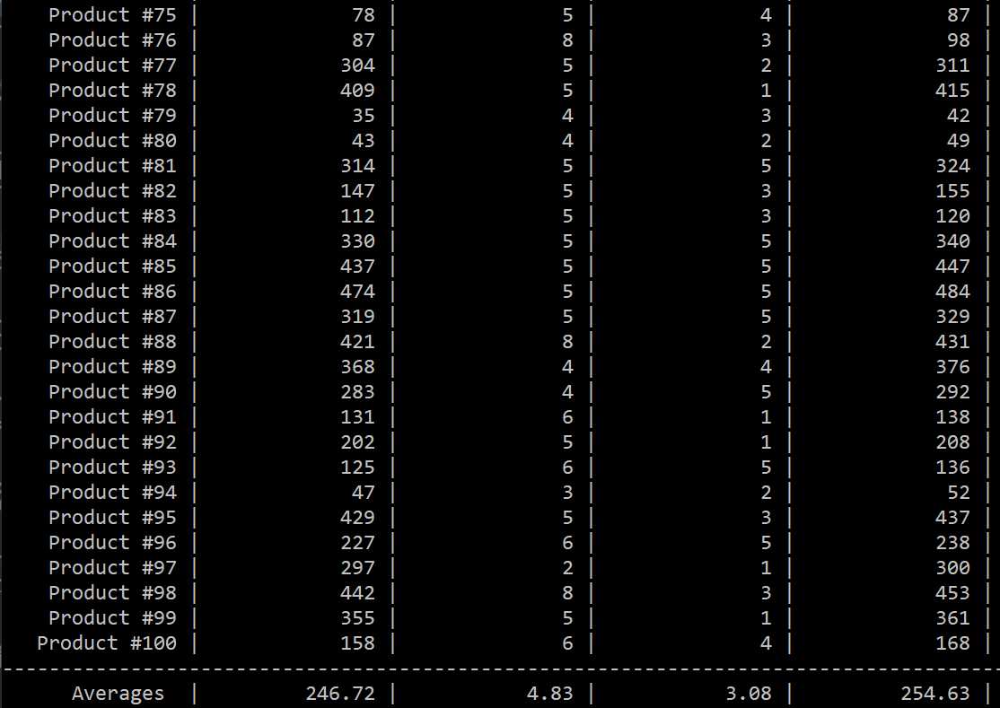

# Discrete Event Simulation

# Lösungsidee a)

Für eine discrete event simulation API wurden 2 virtuell Basisklassen implementiert, von denen abgeleitet werden kann.

## simulation.h

### Datenkomponenten

Die Events werden in einer priority queue gespeichert. Um eine korrekte Sortierung zu garantieren, wird ein event_comparator implementiert.

```c++
struct event_comparator {
	bool operator() (const std::shared_ptr<event>& left,
                     const std::shared_ptr<event>& right)
                     const {
		return (*left > *right);
	}
};

using prio_queue =	std::priority_queue<std::shared_ptr<event>,
					std::vector<std::shared_ptr<event>>,
					event_comparator>;
```

### Öffentliche Methoden

Konstruktor und destruktor werden nicht verändert, da in der gesamten API nur shared pointer verwendet werden. Der zweite Konstruktor erlaubt, bereits bei der Erstellung eine List von Events zu überreichen.

```c++
simulation() = default;

simulation(const std::initializer_list<
            std::shared_ptr<event>> init_list) {
    for (const auto& ev : init_list) {
        active_queue.push(ev);
    }
}

virtual ~simulation() = default;
```

<div style="page-break-after: always;"></div>

Mit Schedule Event kann ein neues Event der Simulation hinzugefügt werden. Die Methode kann überschrieben werden.

```c++
virtual void schedule_event(const std::shared_ptr<event>& new_event) {
    active_queue.push(new_event);
}
```

Die Methode Run führt die gesamte Simulation aus, bis keine Events mehr vorhanden sind. Die Methode Step führt nur das nächste Event durch.

```c++
virtual void run(){
    bool stopped = fire_event();
    while (!stopped) {
        stopped = fire_event();
    }
    stop();
}

void step() {
    if (fire_event(true)) {
        stop();
    }
}
```

### Protected Methoden

Die virtuelle Methode *fire_event* führt das nächste Event in der Liste aus. Das oberste Element wird aus der Queue genommen und ausgeführt. Die Ausführung des Events kann eine Liste neuer Events zurück geben, die wieder in die Queue eingefügt werden. Ist die Queue leer, gibt diese Methode **TRUE** zurück.

```c++
virtual bool fire_event(bool output = false) {
    if (active_queue.empty()) { return true; } else {
        auto cur_event = active_queue.top();
        if (output)
			std::cout << "[SIM][EVENT]: " << cur_event->name() 
                      << " [TIME] " << cur_event->get_time() << std::endl;
        active_queue.pop();
        std::vector<std::shared_ptr<event>> new_events = 
                                cur_event->process_event();
        for (const auto& ev : new_events) {
            active_queue.push(ev);
        }
        return false;
    }
}
```

## event.h

### Datenkomponenten

Ein Event hat 2 protected Datenkomponenten:

```c++
std::string m_name;
std::time m_time;
```

Gespeichert werden der Name und die Zeit des Events.

### Öffentliche Methoden

Im Konstruktor werden Name und Zeit übergeben, der Destruktor wird nicht benötigt.

```c++
event(std::string& name, std::time_t t = 1) 
    : m_name{ name }
    , m_time{ t } {}

virtual ~event() = default;
```

Um einfaches Vergleichen zu ermöglichen, werden die Operatoren **>** und **<** überschrieben.

```c++
friend bool operator< (const event& lhs, const event& rhs) {
    return (lhs.m_time < rhs.m_time);
}

friend bool operator> (const event& lhs, const event& rhs) {
    return (lhs.m_time > rhs.m_time);
}
```

Die vollständig virtuelle Funktion *process_event()* muss von abgeleiteten Klassen überschrieben werden.

```c++
virtual std::vector<std::shared_ptr<event>> process_event() = 0;
```

# Lösungsidee b)

Um die API zu verwenden, kann von *simulation* abgeleitet werden. Wenn die *fire_event* Methode nicht überschrieben werden muss, kann direkt *simulation* verwendet werden.

Weiters muss mindestens eine von *event* abgeleitete Klasse erstellt werden und die *process_event* Methode implementiert werden. Werden zusätzliche Datenkomponenten benötigt, sollten sie in dieser Klasse deklariert werden.

## machine_simulation.h

### Datenkomponenten

Die Simulation speichert die Kapazität des Buffers und der Maschine B. In einem Vector werden alle Produkte zur statistischen Auswertung gespeichert. (Struct *product* wird in *machine_event.h* definiert)

```c++
unsigned int buffer_capacity{};
unsigned int machine_b_capacity{};
std::vector<product> m_products{};
```

### Öffentliche Methoden

Der Konstruktor nimmt als Argumente die Kapazitäten von Buffer und Maschine B, der Dekonstruktor wird nicht benötigt.

```c++
machine_simulation(unsigned int buffer_capacity, unsigned int b_capacity)
    : simulation()
    , buffer_capacity{ buffer_capacity }
    , machine_b_capacity{ b_capacity } { }

virtual ~machine_simulation() override = default;
```

Die Methode *schedule_event* wird überschrieben, um zu überprüfen, ob ein neues Produkt in die Simulation aufgenommen wird. Dafür wird die private Methode *find_product* verwendet, die den Index des gewünschten Produkts im Vector zurückgibt.

```c++
void schedule_event(const std::shared_ptr<event>& new_event) override {
    int const pos = find_product(new_event->name());
    if (pos == -1) {
        m_products.push_back(product{ new_event->name() });
    }
    
    active_queue.push(new_event);
}
```

Die *fire_event* Methode wird überschrieben. Das Event mit der höchsten Priorität wird von *event* in ein *machine_event* gecasted, um bei der Funktion *process_event* eine Referenz auf den dazugehörigen Eintrag im produkt-vector übergeben zu können.

```c++
bool fire_event(bool output = false) override {
    if (active_queue.empty()) {
        return true;
    }
    else {
        auto const cur_event = active_queue.top();
        auto cur_machine_event = dynamic_pointer_cast<machine_event>(cur_event);
        if (output)
			std::cout << "[SIM][EVENT]: " << cur_event->print_name() 
                      << " [TIME] " << cur_event->get_time() << std::endl;
        active_queue.pop();

        int const prod_nr = find_product(cur_event->name());
        std::vector<std::shared_ptr<event>> new_events =
            cur_machine_event->process_event(m_products[prod_nr]);
        
        for (const auto& ev : new_events) {
            active_queue.push(ev);
        }
        return false;
    }
}
```

Die Methode *print_results* gibt die im product-vector gespeicherten Daten Formatiert aus. Da es sich im Wesentlichen nur um Ausgabe und Formatierung handelt und die Zeilen sehr lang sind, wird diese Methode nicht in der Dokumentation abgebildet, der Code sollte aber selbsterklärend sein.

Weiters werden mehrere Methoden implementiert, um die Kapazitätsvariablen zu manipulieren bzw. um zu überprüfen, ob noch Kapazitäten vorhanden sind.

```c++
bool b_has_capacity() const {
    return machine_b_capacity > 0;
}

bool buffer_has_capacity() const {
    return buffer_capacity > 0;
}

void b_start_processing(const int n = 1) {
    machine_b_capacity -= n;
}

void b_done_processing(const int n = 1) {
    machine_b_capacity += n;
}

void buffer_add(const int n = 1) {
    buffer_capacity -= n;
}

void buffer_remove(const int n = 1) {
    buffer_capacity += n;
}
```

### Private Methoden

Die Methode *find_prouct* durchläuft den product-vector, bis ein Produkt gefunden wird, dessen Name gleich dem übergebenen String ist. Wird kein Produkt gefunden, gibt die Funktion -1 zurück.

```c++
int find_product(std::string name) {
    int curr = 0;
    while (curr < m_products.size()) {
        if (m_products[curr].name._Equal(name)) {
            return curr;
        } else {
            curr++;
        }
    }

    return -1;
}
```

## machine_event.h

Diese Klasse dient als Basisklasse für alle Events dieser Simulation und wird von *event* abgeleitet. Jedes Event dieser Simulation benötigt auch eine Referenz auf die Simulation. Diese kann jedoch nicht in dieser Klasse deklariert werden, da sich sonst durch die #includes eine Cross-Reference ergeben würde.

### Structs

Im struct product werden der Name des Produkts und die Zeit gespeichert, die das Produkt in den jeweiligen Events verbringt.

```c++
struct product {
	std::string name{};
	unsigned int time_spent_a{ 0 };
	unsigned int time_spent_buffer{ 0 };
	unsigned int time_spent_b{ 0 };
};
```

### Öffentliche Methoden

Da eine zusätzliche Datenstruktur für diese Simulation benötigt wird, wird zusätzlich zu *process_event()* noch eine virtuelle Methode *process_event(product& prod)* Angeboten.

```c++
machine_event(std::string name, std::time_t t) : event(name, t) {}

virtual ~machine_event() override = default;

virtual std::vector<std::shared_ptr<event>> process_event() override = 0;

virtual std::vector<std::shared_ptr<event>> process_event(product& prod) = 0;
```

## machine_a_event.h

### Datenkomponenten

```c++
const std::shared_ptr<machine_simulation>& sim_ref{ nullptr };
```

### Öffentliche Methoden

Zusätzlich zum Konstruktor, der Name, Zeit und Referenz auf die Simulation übernimmt, wird ein Konstruktor implementiert, der eine Referenz auf ein machine_a_event übernimmt. In diesem Konstruktor wird das Element kopiert und zur Zeit ein zufälliger Wert zwischen 1 und 5 addiert. Dies wird benötigt, wenn ein Event nicht ausgeführt werden kann, weil der Buffer voll ist.

```c++
machine_a_event(std::string name, std::time_t t, const std::shared_ptr<machine_simulation>& sim)
    : machine_event(name, t)
    , sim_ref{ sim } { }

machine_a_event(machine_a_event* ev)
    : machine_event(ev->m_name, ev->m_time + get_random_time(1, 5))
    , sim_ref{ ev->sim_ref } { }
```

Die Methode *process_event(product& prod)* ruft die Methode *process_event()* auf. Wenn diese ein Event zurückgibt, wird die Zeit in *prod* gespeichert.

Die Methode *process_event()* überprüft mithilfe der Simulationsreferenz, ob der Buffer voll ist. Ist dies der Fall, wird das Event mit einem erhöhten Zeitwert zurückgegeben. Hat der Buffer Platz, wird ein buffer_event erzeugt und zurückgegeben.

```c++
std::vector<std::shared_ptr<event>> process_event() override {
    if (sim_ref->buffer_has_capacity()) {
        sim_ref->buffer_add();
        return std::vector<std::shared_ptr<event>>{std::make_shared<buffer_event>
                (m_name, m_time + get_random_time(1, 5), sim_ref)};
    } else {
        return std::vector<std::shared_ptr<event>>{
                std::make_shared<machine_a_event>(this)};
    }
}

std::vector<std::shared_ptr<event>> process_event(product& prod) override {
    auto ret = process_event();
    if (!ret.empty()) {
        prod.time_spent_a = m_time;
    } return ret;
}
```

## buffer_event.h

*buffer_event* ist ident mit *machine_a_event*, mit Ausnahme der *process_event* Funktionen.

In *process_event()* wird überprüft, ob Maschine B noch freie Kapazitäten hat. Ist dies der Fall, wird die Kapazität von B verringert, im Buffer wird ein Platz freigegeben und die Funktion gibt ein *machine_b_event* zurück. Ist kein Platz, wird dasselbe Event mit einem erhöhten Zeitwert zurückgegeben.

```c++
std::vector<std::shared_ptr<event>> process_event() override {
    if (sim_ref->b_has_capacity()) {
        sim_ref->buffer_remove();
        sim_ref->b_start_processing();
        return std::vector<std::shared_ptr<event>>{std::make_shared<machine_b_event>
                (m_name, m_time + get_random_time(1, 5), sim_ref)};
    } else {
        return std::vector<std::shared_ptr<event>>{
                std::make_shared<buffer_event>(this)};
    }
}
```

## machine_b_event.h

*machine_b_event* ist ident mit den anderen beiden Events. Da das Endlager keine Limitationen hat, muss in der *process_event()* Methode keine Überprüfung durchgeführt werden und es wird ein leerer Vector (also kein neues Event) zurückgegeben.

```c++
std::vector<std::shared_ptr<event>> process_event() override {
    sim_ref->b_done_processing();
    return std::vector<std::shared_ptr<event>>{};
}

std::vector<std::shared_ptr<event>> process_event(product& prod) override {
    prod.time_spent_b = m_time - prod.time_spent_buffer - prod.time_spent_a;
    return process_event();
}
```

<div style="page-break-after: always;"></div>

## time_manipulation.h

Diese Datei beinhaltet Hilfsfunktionen um einen zufälligen *std::time_t* Wert zu liefern. Dafür wird die *get_random_time* Methode verwendet.

```c++
inline std::time_t get_random_time(const int min, const int max) {
	std::random_device rd;
	std::mt19937 gen(rd());
	std::uniform_int_distribution<> const distr(min, max);

	return distr(gen);
}
```

# main.cpp

Um die Simulation auszuführen, wird ein shared pointer auf eine *machine_simulation* erstellt. Dabei werden die Kapazitäten für den Buffer und die Maschine B übergeben. In einer WHILE Schleife werden *machine_a_events* erzeugt und der Simulation hinzugefügt.

```c++
std::shared_ptr<machine_simulation> sim = std::make_shared<machine_simulation>(10, 10);
int product_number = 1;
std::string event_name;

while (product_number <= 100) {
    event_name = "Product #";
    event_name = event_name.append(std::to_string(product_number++));
    sim->schedule_event(std::make_shared<machine_a_event>(event_name, get_random_time(1, 5), sim));
}
```

Das Programm liest User Input ein und führt entsprechende Funktionen aus.

```c++
std::cout << "Controls:" << std::endl;
std::cout << "s : Next Step" << std::endl;
std::cout << "r : Run complete Simulation" << std::endl;
std::cout << "p : Print results" << std::endl;
std::cout << "q : Quit program" << std::endl;

std::string input;
std::cin >> input;

while (!input.empty()) {
    if (input._Equal("s")) {
        sim->step();
    } else if (input._Equal("r")) {
        sim->run();
    } else if (input._Equal("p")) {
        sim->print_results();
    } else if (input._Equal("q")) {
        break;
    }
    std::cin >> input;
}
```

<div style="page-break-after: always;"></div>

# Testfälle

Zwecks übersicht werden bei den Testfällen nur die letzten Zeilen und die Durchschnittswerte ausgegeben.

|   |  # Produkte  |  Buffer Kapazität  |  Maschine B Kapazität  |
|---|:---:|:---:|:---:|
|Testfall 1|100|10|10|
|Testfall 2|100|1|1|
|Testfall 3|500|20|10|
|Testfall 4|10|2|2|

---

## Testfall 1

Die Kapazitäten von Buffer und Maschine B sind relativ groß, daher brauchen die Produkte am längsten in Maschine A, da sie dort auf einen freien Platz im Buffer warten.


<div style="page-break-after: always;"></div>

## Testfall 2

Wird die Kapazität verringert, steigt der Zeitaufwand in Maschine A enorm.



<div style="page-break-after: always;"></div>

## Testfall 3

Da nach Maschine B keine Limitierungen bestehen, wird die durchschnittliche Zeit immer um 2.5 liegen, egal wie viele Produkte produziert werden.


<div style="page-break-after: always;"></div>

## Testfall 4

Kleinerer Testfall, um die gesamte Tabelle darzustellen.


